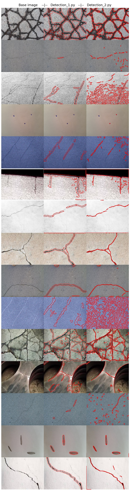

# Defect detections

## 1. Using OpenCV:
  - _Detections_1.py_
    - Based on Sobel edge detections 
  - _Detections_2.py_
    - Based on [this](https://link.springer.com/article/10.1186/s13640-017-0187-0#Equ1) approach
    
## Results:

## 2. Neural Network:
   - I'm working on in. Actually I have made a keras U-net network _Detections_UNet.py_, which is in early stage. 
   - I have created a training data  [images](https://drive.google.com/drive/folders/15p_ywfItvNIEJmDEGxJbWXglUtm9okIA?usp=sharing) and [masks](https://drive.google.com/drive/folders/1zTfdqN3_q85ikhWmTzMaPqxrXZOS9nq3?usp=sharing) for them from this [data](https://data.mendeley.com/datasets/5y9wdsg2zt/1).
